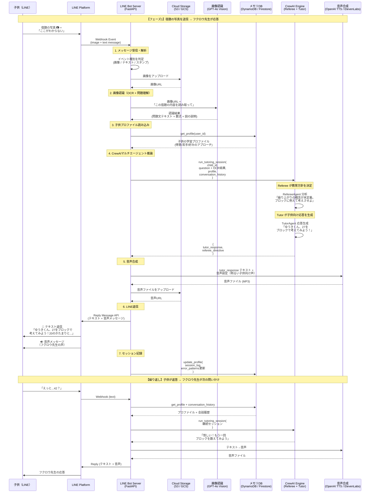

# Toy Alchemy - LINE Bot 連携アーキテクチャ設計

## 概要

子供がLINEで宿題の写真と質問を送ると、画像認識 → マルチエージェント推論 → 音声合成を経て、
フクロウ先生がテキストと音声で応答する。本ドキュメントはフェーズ2以降の実装ガイドとなる。

---

## システム全体のシーケンス図



---

## コンポーネント詳細

### 1. LINE Bot Server（FastAPI）

| 項目 | 内容 |
|------|------|
| フレームワーク | FastAPI + line-bot-sdk (v3) |
| ホスティング | AWS Lambda + API Gateway / Cloud Run |
| 役割 | Webhook受信、各サービスのオーケストレーション |

**主要エンドポイント:**

```
POST /webhook    … LINE Webhookイベント受信
GET  /health     … ヘルスチェック
```

**処理フロー（擬似コード）:**

```python
@app.post("/webhook")
async def handle_webhook(request: Request):
    events = parse_webhook(request)

    for event in events:
        user_id = event.source.user_id

        # 画像メッセージの場合
        if event.message.type == "image":
            image_url = upload_to_storage(event.message)
            ocr_result = await vision_recognize(image_url)
            store_context(user_id, ocr_result)

        # テキストメッセージの場合
        if event.message.type == "text":
            profile = load_child_profile(user_id)
            history = get_conversation_history(user_id)
            context = get_stored_context(user_id)  # OCR結果があれば結合

            result = run_tutoring_session(
                child_id=user_id,
                child_message=event.message.text + context,
                conversation_history=history,
            )

            audio_url = await synthesize_speech(result["tutor_response"])

            await reply(event, [
                TextMessage(text=result["tutor_response"]),
                AudioMessage(original_content_url=audio_url),
            ])

            save_session_log(user_id, event.message.text, result)
```

### 2. 画像認識（Vision API）

| 項目 | 内容 |
|------|------|
| API | OpenAI GPT-4o（Vision機能） |
| 入力 | 宿題の写真（手書きノート、プリント等） |
| 出力 | 問題文テキスト、数式、図の説明 |

**プロンプト設計のポイント:**
- 手書き文字のOCR精度を上げるため、「小学生の手書き」であることを明示
- 数式はLaTeX形式ではなく平文で出力（CrewAIに渡しやすくするため）
- 図がある場合は「何が描かれているか」を自然言語で説明

### 3. メモリDB

| 項目 | 内容 |
|------|------|
| サービス | DynamoDB / Firestore（どちらでも可） |
| パーティションキー | `child_id`（= LINE ユーザーID） |
| データ | `memory_schema.json` に準拠 |

**MVP段階ではJSON ファイルベース**（`src/memory/` ディレクトリ）で十分。
ユーザー数が増えた段階でDBに移行する。

### 4. 音声合成（TTS）

| 項目 | 内容 |
|------|------|
| 第1候補 | OpenAI TTS API（`tts-1-hd`, voice: `nova`） |
| 第2候補 | ElevenLabs（カスタム声が作れる） |
| 出力形式 | MP3（LINE AudioMessageが対応） |

**音声キャラ設定:**
- 明るく優しいトーン
- 話速はやや遅め（子供が聞き取りやすい）
- 将来的にElevenLabsでフクロウ先生専用の声を作成

### 5. 会話履歴管理

**LINE Bot固有の考慮事項:**
- LINEのReply APIはイベントごとに1回しか返信できない
- 会話の「セッション」はサーバー側で管理（30分無操作でセッション終了）
- 会話履歴は直近10往復を保持し、CrewAIに注入

---

## 環境変数

```env
# LINE Bot
LINE_CHANNEL_SECRET=xxx
LINE_CHANNEL_ACCESS_TOKEN=xxx

# OpenAI (Vision + TTS)
OPENAI_API_KEY=xxx

# Cloud Storage
STORAGE_BUCKET=toy-alchemy-media

# メモリDB (本番用)
DYNAMODB_TABLE=toy-alchemy-profiles
```

---

## フェーズ別ロードマップ

| フェーズ | 内容 | 状態 |
|----------|------|------|
| **1. コアエンジン** | CrewAI Tutor+Referee 連携 | ✅ 完了 |
| **2. LINE Bot 基盤** | Webhook受信、テキスト対話 | 🔜 次回 |
| **3. 画像認識統合** | 宿題写真 → OCR → エンジン | 📋 計画中 |
| **4. 音声合成統合** | テキスト → 音声 → LINE返信 | 📋 計画中 |
| **5. メモリDB移行** | JSON → DynamoDB/Firestore | 📋 計画中 |
| **6. 保護者ダッシュボード** | 学習レポート、設定画面 | 💡 構想 |
